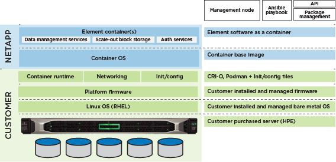

= Erste Schritte mit NetApp SolidFire Enterprise SDS
:allow-uri-read: 
:icons: font
:imagesdir: ../media/

[role="lead"]
NetApp SolidFire Enterprise SDS (ESDS) bietet die Vorteile der Scale-Out-Technologie von SolidFire und der NetApp Element Software-Datenservices auf der Hardware Ihrer Wahl, die der Referenzkonfiguration für SolidFire ESDS entspricht. SolidFire ESDS stellt die NetApp Element-Software unabhängig von der zugrunde liegenden Hardware bereit. So können Sie sämtliche Funktionen der Elemente entweder auf einer NetApp Appliance oder auf einem Allzweck-Server nutzen, der mit der NetApp Referenzkonfiguration konform ist.

== Hauptmerkmale von SolidFire ESDS

* Ermöglicht die Installation und Ausführung von Element Software über Container.
* Bietet Storage-Funktionen und Zuverlässigkeit der Enterprise-Klasse auf vorab validierten Standard-Serverplattformen. Sie können Produktions-Workloads ausführen, nachdem Sie die SolidFire ESDS-Software auf der vorgegebenen x86-Serverplattform und den zugrunde liegenden Komponenten (CPU, Arbeitsspeicher, SSD-Laufwerke, Cache, Netzwerk, Firmware) gemäß der veröffentlichten Referenzkonfiguration im https://mysupport.netapp.com/matrix/imt.jsp?components=97283;&solution=1757&isHWU&src=IMT["NetApp Interoperabilitäts-Matrix-Tool (IMT)"].
* Bietet Softwareverschlüsselung für Daten im Ruhezustand. Mithilfe der Softwareverschlüsselung können alle auf die SSDs in einem Storage-Cluster geschriebenen Daten verschlüsselt werden. Dies bietet eine primäre Verschlüsselungsschicht in SolidFire ESDS-Knoten, die keine Self-Encrypting Drives (SEDs) enthalten.
* Ermöglicht mithilfe von Quality-of-Service-Richtlinien (QoS) eine vorhersehbare Cluster-Performance.
* Unterstützt Cluster mit vier bis 40 Nodes.
* Mit dem Term Capacity License Modell lizenziert.
* Nutzt ein neues Modell für Support durch Support-Vereinbarungen mit Technologiepartnern.

Mit SolidFire ESDS bietet NetApp Container für Element, das Sie auf Standard-Hardware ausführen können, die die erforderlichen Anforderungen erfüllt. Sie bringen Ihren eigenen Server mit einem bereits installierten Betriebssystem. Kunden verwenden ein Automatisierungs-Tool wie Ansible, um die Compliance-Prüfung vor der Installation auszuführen und den SolidFire ESDS zu installieren. Im Rahmen Ihrer Vorinstallationsaufgaben sollten Sie den Management-Node installieren, der die Protokollbündelsammlung sowie andere Services wie SolidFire AIQ unterstützt. Hier ist ein Überblick über die Architektur, der die verschiedenen Komponenten der ESDS-Umgebung von SolidFire anzeigt:

NOTE: Sie sind für die Konfiguration, Überwachung und Verwaltung des Lebenszyklus der Plattform sowie für die Konfiguration der Netzwerkschnittstellen und Routing-Tabellen verantwortlich.

Einige Funktionen der NetApp Element-Software gelten nicht für SolidFire ESDS. Native Element Funktionen für herkömmliche SolidFire Storage Nodes wie Hardware-Monitoring, Firmware-Updates, Verschlüsselung als Rest (OHR) mit Self-Encrypting Drives (SEDs) und Fibre Channel sind für SolidFire ESDS deaktiviert.

* Externes Verschlüsselungsmanagement (EKM)
* Hardware-Verschlüsselung
* Multi-Drive Slice Service (MDSS)
* Hardware-Überwachung, Aktualisierungen der Host-Plattform (z. B. Treiber, Firmware- und Betriebssystempakete) und Fibre Channel

== Schnellstartinformationen

Hier finden Sie eine Reihe von Anweisungen für die Installation von SolidFire ESDS link:../media/SDS_Quick_Start_Guide.pdf["Hier"^].

== Lizenzrichtlinien

SolidFire ESDS unterliegt dem NetApp Term Capacity License Modell.

Hier finden Sie eine allgemeine Übersicht über die Richtlinien dieses Modells:

* Softwarekosten sind abhängig von der Rohkapazität (Größe der Laufwerke, also die Anzahl der Laufwerke im Node oder Cluster). Somit lassen sich die Softwarekosten für dieses Modell leicht vorhersagen.
* Sie benötigen keinen Softwarelizenzschlüssel. Sie erhalten auf dem Auftrag eine Master-Seriennummer für die Software, die im Dokumentenkit enthalten ist, das Sie nach der Bestellung erhalten. Sie müssen diese Master-Seriennummer behalten, da sie für den Support verwendet wird.

Weitere Informationen finden Sie unter https://www.netapp.com/us/media/sb-4059.pdf["Kaufmodelle für NetApp HCI und SolidFire"].

== Schnittstellen zur Installation und Verwendung von SolidFire ESDS

Hier ist eine Liste der Tools und Schnittstellen, die Sie für die Installation, Überwachung und Verwaltung von SolidFire ESDS verwenden:

[cols="3*"]
|===
| Tool/Schnittstelle | Wer verwendet den Storage | Beschreibung 

 a| 
Ansible-Compliance-Überprüfung, Rolle
 a| 
Kunde
 a| 
Überprüfen, ob die Plattform mit der in angegebenen Referenzkonfiguration übereinstimmt https://mysupport.netapp.com/matrix/imt.jsp?components=97283;&solution=1757&isHWU&src=IMT["NetApp Interoperabilitäts-Matrix-Tool (Anmeldung erforderlich)"^]. Sie sollten dies vor der Installation von SolidFire ESDS tun.

 a| 
Ansible-Installationsrolle
 a| 
Kunde
 a| 
Zur Installation von SolidFire ESDS.

 a| 
Management-Node
 a| 
Kunde
 a| 
Für Protokollsammlung und Management-Services wie AIQ

 a| 
NetApp Hybrid Cloud Control
 a| 
Kunde, NetApp Support
 a| 
Für die Cluster-Erstellung und das Management pro Node sowie die Erfassung von Protokollen vom Management-Node.

 a| 
Hewlett Packard Enterprise (HPE) Integrated Lights Out (iLO)
 a| 
Kunde, HPE Support
 a| 
Zum Erfassen von Daten über Ereignisse und Status für die Ursachenanalyse.

 a| 
Dell Integrated Dell Remote Access Controller (iDRAC)
 a| 
Kunde, Dell Support
 a| 
Zum Erfassen von Daten über Ereignisse und Status für die Ursachenanalyse.

 a| 
NetApp Element Software-UI
 a| 
Kunde
 a| 
Für das Management von ESDS-Speicherclustern von SolidFire.

 a| 
Active IQ
 a| 
Kunde, NetApp Support
 a| 
Für das Monitoring des Cluster-Systemzustands.

 a| 
Eine Sammlung
 a| 
NetApp Support
 a| 
Für zusätzliche Protokollerfassung.

|===

== Übersicht über die Installation

Sie können SolidFire ESDS mit einem Automatisierungs-Tool wie Ansible installieren.

Hier ein grundlegender Überblick über die Installation mit Ansible:

image::../media/esds_installation_workflow.png[Zeigt den Installations-Workflow.]

== Dynamische Node-Bewertung

Mit der in Element 12.3.1 eingeführten dynamischen Knotenbewertung können Sie 24 unterstützte CPUs pro ESDS-Plattform nutzen, im Gegensatz zum heutigen Modell einer einzigen CPU pro Plattform.

Die dynamische Knotenbewertung wird auf allen Plattformen unterstützt, die derzeit auf ESDS unterstützt werden: DL360, DL380 und R640.

Bei der ersten Version der dynamischen Node-Bewertung beträgt die maximale IOPS eines jeden Node 100.000 IOPS.

== Weitere Informationen

* https://www.netapp.com/data-storage/solidfire/documentation/["Ressourcen-Seite zu NetApp SolidFire"^]
* https://docs.netapp.com/sfe-122/topic/com.netapp.ndc.sfe-vers/GUID-B1944B0E-B335-4E0B-B9F1-E960BF32AE56.html["Dokumentation für frühere Versionen von NetApp SolidFire und Element Produkten"^]

