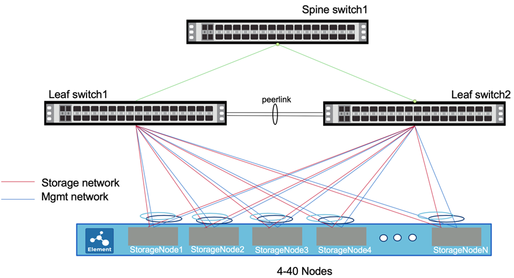

= Konfigurieren Sie das Hostnetzwerk
:allow-uri-read: 
:icons: font
:imagesdir: ../media/

[role="lead"]
Verwenden Sie die Beispiele und Tipps, die Sie zur Konfiguration des Hostnetzwerkes verwenden, bevor Sie SolidFire ESDS installieren.

Hier ist eine Beispiel für eine Netzwerkkonfiguration:

In diesem Beispiel sind zwei Schnittstellen auf dem Storage-Node Netzwerk https://access.redhat.com/documentation/en-us/red_hat_enterprise_linux/7/html/networking_guide/ch-configure_network_teaming#sec-Understanding_Network_Teaming["Team"^] Aus Redundanzgründen mit dem Managementnetzwerk verbunden. Ebenso werden zwei zusätzliche Schnittstellen miteinander kombiniert und mit dem Storage-Netzwerk verbunden.

NOTE: Jede Schnittstelle hat eine Konfigurationsdatei namens ifcfg-<Interface-Name>X, wobei X die Nummer der Schnittstelle ist, beginnend mit null oder 1 je nach verwendeter Namenskonvention. Die Konfigurationsdateien werden beim ersten Erstellen der Schnittstellen erstellt. Für jede der beiden physischen Schnittstellen, die mit dem Storage-Netzwerk verbunden sind, sollte bereits eine Konfigurationsdatei vorhanden sein. Für jede der beiden physischen Schnittstellen, die mit dem Management-Netzwerk verbunden sind, sollte auch eine Konfigurationsdatei vorhanden sein. Die Schnittstellenkonfigurationsdateien sind im Verzeichnis /etc/sysconfig/Network-scripts abgelegt. Siehe https://access.redhat.com/documentation/en-us/red_hat_enterprise_linux/7/html/networking_guide/getting_started_with_networkmanager["Schnittstellenkonfigurationsdateien"^].

TIP: In den hier angegebenen Beispielen sind die Namen der Storage- und Managementoberfläche für HPE-Server angegeben. Wenn Sie einen Dell-Server haben, unterscheiden sich die Schnittstellennamen. Die Namen der Speicherschnittstelle für den Dell-Server lauten em1 und em2. Die Namen der Managementoberfläche für den Dell-Server sind p3p1 und p3p2.

.Schritte
. Installieren `NetworkManager-dispatcher-routing-rules` Paket und stellen Sie sicher, dass die entsprechenden Repositorys konfiguriert sind.
. Konfigurieren Sie Ihren Netzwerk-Switch mithilfe der Dokumentation des Switch-Anbieters. Genaue Anweisungen zum Konfigurieren des MLAG-Protokolls (Multi-Chassis Link Aggregation Group) und dem Link Aggregation Control Protocol (LACP) finden Sie in der Dokumentation Ihres Switch-Anbieters.
+

NOTE: Es wird empfohlen, LACP Fallback zu konfigurieren und LACP Individual Port Suspension Verhalten durch Ausführen zu deaktivieren `no lacp suspend-individual`. So kann der AccessPoint Link auch ohne LACP-Pakete bei Fehlkonfigurationen übertragen werden.

. Bearbeiten Sie die beiden Konfigurationsdateien für die physischen Schnittstellen, die mit dem Storage-Netzwerk verbunden sind. Verwenden Sie hierfür das folgende Beispiel: Jumbo-Frame-Einstellung im Storage-Netzwerk wird dringend empfohlen, ist jedoch nicht erforderlich. In diesem unten stehenden Beispiel ist der Name des Speicherinterface ens2f0 und der Name des Speicherteams team10G:
+

IMPORTANT: IN allen hier aufgeführten Beispielkonfigurationen VERWENDEN NAME und GERÄT dieselben Werte. Sie können verschiedene Werte verwenden, wenn Sie dies tun.

+
[listing]
----
# cat /etc/sysconfig/network-scripts/ifcfg-ens2f0
# 10G Team Physical Port to Storage Network
NAME=ens2f0
DEVICE=ens2f0
ONBOOT=yes
TEAM_MASTER=team10G
DEVICETYPE=TeamPort
MTU=9000
----
. Bearbeiten Sie die beiden Konfigurationsdateien für die mit dem Managementnetzwerk verbundenen Schnittstellen anhand des folgenden Beispiels. In diesem Beispiel lautet der Name der Management-Schnittstelle eno5 und der Name des Management-Teams team1G:
+
[listing]
----
# cat ifcfg-eno5
# 1G Team Physical Port to Management Network
NAME=eno5
DEVICE=eno5
ONBOOT=yes
TEAM_MASTER=team1G
DEVICETYPE=TeamPort
----
. Erstellen Sie die Team Interface-Datei für das Storage Team anhand des folgenden Beispiels. In diesem Beispiel heißt das Team team10G. Sie befindet sich auf dem Storage-Netzwerk mit dem Network Teaming lacp Läufer.
+

NOTE: Für Storage-Schnittstellen wird die aktiv/aktiv-Konfiguration empfohlen. Diese Konfiguration erfordert ein zusätzliches aktiv/aktiv-MLAG-Protokoll (Multi-Chassis Link Aggregation Group) und das Link Aggregation Control Protocol (LACP) für die Konfiguration auf den Switches. Diese Konfiguration erfordert das https://access.redhat.com/documentation/en-us/red_hat_enterprise_linux/7/html/networking_guide/sec-Understanding_the_Network_Teaming_Daemon_and_the_Runners["Network Teaming lacp Runner"^].

+
[listing]
----
# cat /etc/sysconfig/network-scripts/ifcfg-team10G
# IPADDR= "SIP"
# GATEWAY= "SIP_GATEWAY"
# Pick one TEAM_CONFIG, activebackup or lacp
# note that lacp require changing switch port to lacp as well

TEAM_CONFIG="{\"runner\": {\"name\": \"lacp\"}, \"link_watch\": {\"name\": \"ethtool\"}}"
PROXY_METHOD=none
BROWSER_ONLY=no
BOOTPROTO=none
DEFROUTE=no
IPV4_FAILURE_FATAL=no
IPV6INIT=no
NAME=team10G
DEVICE=team10G
ONBOOT=yes
DEVICETYPE=Team
IPADDR=192.0.2.2
PREFIX=24
GATEWAY=192.0.2.1
NM_CONTROLLED=yes
MTU=9000
----
. Erstellen Sie die Team-Interface-Datei für das Management-Team anhand des folgenden Beispiels. In diesem Beispiel heißt das Team team1G. Er befindet sich im Managementnetzwerk, auf dem der Network Teaming activeBackup Runner ausgeführt wird.
+

NOTE: Die aktiv/Passiv-Konfiguration wird für Management-Schnittstellen empfohlen, allerdings können Sie auch die aktiv/aktiv-Konfiguration verwenden. Auf den Lamellenschaltern sind keine zusätzlichen Konfigurationen erforderlich. Diese Konfiguration verwendet das https://access.redhat.com/documentation/en-us/red_hat_enterprise_linux/7/html/networking_guide/sec-Understanding_the_Network_Teaming_Daemon_and_the_Runners["Network Teaming activeBackup Runner"].

+
[listing]
----
# cat /etc/sysconfig/network-scripts/ifcfg-team1G
# IPADDR= "MIP"
# GATEWAY= "MIP_GATEWAY"
# DNS1= "DNS"
# Pick one TEAM_CONFIG, activebackup or lacp
# note that lacp require changing switch port to lacp as well

TEAM_CONFIG="{\"runner\": {\"name\": \"activebackup\"}, \"link_watch\": {\"name\": \"ethtool\"}}"
#TEAM_CONFIG=”{ \”runner\”: {\”name\”: \”lacp\”, \”active\”: true, \”fast_rate\”: true }}”
PROXY_METHOD=none
BROWSER_ONLY=no
BOOTPROTO=none
DEFROUTE=yes
IPV4_FAILURE_FATAL=no
IPV6INIT=no
IPV6_AUTOCONF=yes
IPV6_DEFROUTE=yes
IPV6_FAILURE_FATAL=no
IPV6_ADDR_GEN_MODE=stable-privacy
NAME=team1G
DEVICE=team1G
ONBOOT=yes
DEVICETYPE=Team
IPADDR=198.51.100.2
PREFIX=24
GATEWAY=198.51.100.1
DNS1=198.51.100.250
NM_CONTROLLED=yes
----
. Bearbeiten Sie das `/etc/iproute2/rt_tables` Datei zum Aktivieren einer neuen Routing-Tabelle mithilfe des folgenden Beispieles. Diese Datei definiert die Zuordnungen, die anstelle von Indexnummern die Namen der Routing-Tabelle verwenden sollen, um auf eine bestimmte Tabelle zu verweisen. Im folgenden Beispiel kann die neue Speicherroutingtabelle team10G mit ihrem Index (20) oder ihrem Namen (team10G) aufgerufen werden:
+
[listing]
----
# cat /etc/iproute2/rt_tables
#
# reserved values
#
255local
254main
253default
0unspec

20   team10G
----
. Im folgenden Beispiel können Sie Routen zur Routing-Tabelle für den Speicherdatenverkehr hinzufügen. Diese Routing-Tabelle weist auf das Speichernetzwerk als Standard-Gateway hin und muss für iSCSI-Datenverkehr verwendet werden. Im folgenden Beispiel lautet der Name der geteam10G Schnittstelle.
+

NOTE: Sie sollten ersetzen `$storage_network`, `$storage_if_name src`, `$SIP table`, `$routing_table_name`, `$storage_default_gw dev`, `$storage_if_name src`, `$SIP table`, und `$routing_table_name` Mit Ihren eigenen Werten.

+
[listing]
----
# cat /etc/sysconfig/network-scripts/route-team10G
$storage_network/24 dev $storage_if_name src $SIP table $routing_table_name
default via $storage_default_gw dev $storage_if_name src $SIP table \
$routing_table_name
----
. Fügen Sie Policy-based Routing hinzu, um die neue Routing-Tabelle zu verwenden, die Sie erstellt haben, wenn der Traffic aus dem SIP oder SVIP stammt. Verwenden Sie das folgende Beispiel und ersetzen Sie durch Ihre eigenen Werte:
+
[listing]
----
# cat /etc/sysconfig/network-scripts/rule-team10G
from $SIP table
$routing_table_name
----
. Starten Sie das Netzwerk neu, um alle Änderungen zu übernehmen.
+
[listing]
----
# systemctl restart network.service
----
. Um die richtlinienbasierten Routing-Regeln zu prüfen, führen Sie den aus `ip rule show` Befehl.
. Um die Routing-Tabelle zu überprüfen, führen Sie den aus `ip route show table` Befehl.

== Weitere Informationen

* https://www.netapp.com/data-storage/solidfire/documentation/["Ressourcen-Seite zu NetApp SolidFire"^]
* https://docs.netapp.com/sfe-122/topic/com.netapp.ndc.sfe-vers/GUID-B1944B0E-B335-4E0B-B9F1-E960BF32AE56.html["Dokumentation für frühere Versionen von NetApp SolidFire und Element Produkten"^]

