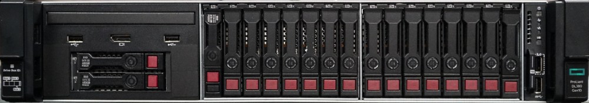

= Ersetzen Sie Laufwerke für HPE DL380
:allow-uri-read: 
:icons: font
:imagesdir: ../media/

[role="lead"]
Wählen Sie aus den hier aufgeführten Verfahren, um ein Laufwerk proaktiv zu ersetzen, ein Laufwerk nach dem Ausfall zu ersetzen und ein Cache-Laufwerk zu ersetzen. Ein Metadatenlaufwerk oder ein Blocklaufwerk im SolidFire ESDS-Cluster ersetzen. Auf der Seite Element UI *Cluster > Laufwerke* werden die Informationen zum Laufwerksverschleiß angezeigt.

*  a drive proactively
*  a faulty drive
*  a cache drive

== Ersetzen Sie ein Laufwerk proaktiv

Führen Sie dieses Verfahren durch, wenn Sie ein Metadatenlaufwerk oder ein Blocklaufwerk im SolidFire ESDS-Cluster proaktiv ersetzen möchten. Auf der Seite Element UI *Cluster* > *Drives* werden die Informationen zum Laufwerksverschleiß angezeigt.

.Was Sie und#8217;ll benötigen
* Stellen Sie über die NetApp Element Software-UI sicher, dass der Cluster in einem guten Zustand ist und es keine Warnungen oder Cluster-Fehler gibt. Sie können über die Management Virtual IP (MVIP)-Adresse des primären Cluster-Knotens auf die Element-UI zugreifen.
* Stellen Sie sicher, dass auf dem Cluster keine aktiven Jobs ausgeführt werden.
* Stellen Sie sicher, dass Sie sich mit allen Schritten vertraut gemacht haben.
* Stellen Sie sicher, dass Sie die erforderlichen Vorsichtsmaßnahmen treffen, um elektrostatische Entladung (ESD) beim Umgang mit Laufwerken zu verhindern.

.Schritte
. Führen Sie die folgenden Schritte in der Element UI aus:
+
.. Wählen Sie in der Element UI die Option *Cluster* > *Laufwerke* > *aktiv*.
.. Wählen Sie das Laufwerk aus, das Sie ersetzen möchten.
.. Notieren Sie sich die Seriennummer des Laufwerks. Dies hilft Ihnen dabei, die entsprechende BayID in der IPMI-Schnittstelle des Knotens zu finden (in diesem Fall HPE Integrated Lights-Out oder iLO).
.. Wählen Sie *Massenaktionen* > *Entfernen*. Nachdem Sie das Laufwerk entfernt haben, wechselt das Laufwerk in den Zustand *Entfernen*. Er bleibt eine Weile im Status *Entfernen* und wartet darauf, dass die Daten auf dem Laufwerk synchronisiert oder auf die übrigen Laufwerke im Cluster verteilt werden. Nach dem Entfernen des Laufwerks wechselt das Laufwerk in den Status *verfügbar*.

. Gehen Sie wie folgt vor, um den Laufwerkschacht des zu ersetzenden Laufwerks zu finden:
+
.. Melden Sie sich bei der IPMI-Schnittstelle des Knotens an (in diesem Fall iLO).
.. Wählen Sie in der linken Navigationsleiste die Option *Systeminformationen* aus, und wählen Sie dann *Speicherung* aus.
.. Ordnen Sie die Seriennummer, die Sie im vorherigen Schritt angegeben haben, mit dem überein, was auf dem Bildschirm angezeigt wird.
.. Suchen Sie nach der Steckplatznummer, die mit der Seriennummer aufgeführt ist. Dies ist der physische Steckplatz, aus dem Sie das Laufwerk entfernen müssen.

. Nachdem Sie das Laufwerk identifiziert haben, entfernen Sie es nun physisch wie folgt:
+
.. Identifizieren Sie die Antriebsbox.
+
Das folgende Bild zeigt die Vorderseite des Servers mit den Laufwerken:

+

.. Drücken Sie den Netzschalter des Laufwerks, das Sie ersetzen möchten. Die LED blinkt 5-10 Sekunden lang und stoppt.
.. Nachdem die LED nicht mehr blinkt und das Laufwerk ausgeschaltet ist, entfernen Sie es vom Server, indem Sie die rote Taste drücken und die Verriegelung ziehen.
+

NOTE: Stellen Sie sicher, dass Sie Laufwerke sehr sorgfältig behandeln.

+
Nachdem Sie das Laufwerk physisch entfernt haben, ändert sich der Laufwerkszustand in der Element-UI in *failed*.

. Wählen Sie in der Element UI die Option *Cluster* > *Laufwerke* > *fehlgeschlagen*.
. Wählen Sie das Symbol unter *Aktionen* und dann *Entfernen* aus.
+
Jetzt können Sie das neue Laufwerk im Knoten installieren.

. Notieren Sie sich die Seriennummer des neuen Laufwerks.
. Setzen Sie das Ersatzlaufwerk ein, indem Sie das Laufwerk vorsichtig mit der Verriegelung in den Schacht schieben und die Verriegelung schließen. Das Laufwerk wird eingeschaltet, wenn es richtig eingesetzt wird.
. Führen Sie die folgenden Schritte durch, um die neuen Laufwerkdetails in iLO zu überprüfen:
+
.. Melden Sie sich bei iLO an.
.. Wählen Sie *Information* > *Integriertes Management-Protokoll*. Sie sehen ein Ereignis, das für das hinzugefügte Laufwerk protokolliert ist.
.. Wählen Sie in der linken Navigationsleiste die Option *Systeminformationen* aus, und wählen Sie dann *Speicherung* aus.
.. Blättern Sie, bis Sie Informationen über den Schacht finden, in dem Sie das Laufwerk ersetzt haben.
.. Überprüfen Sie, ob die Seriennummer auf dem Bildschirm mit der Seriennummer des neuen Laufwerks übereinstimmt, das Sie ersetzt haben.

. Fügen Sie die neuen Laufwerksinformationen in das hinzu `sf_sds_config.yaml` Datei für den Knoten, in dem Sie das Laufwerk ersetzt haben.
+
Der `sf_sds_config.yaml` Datei wird in gespeichert `/opt/sf/`. Diese Datei enthält alle Informationen über die Laufwerke im Node. Jedes Mal, wenn Sie ein Laufwerk ersetzen, müssen Sie die Ersatzlaufwerk-Informationen in dieser Datei eingeben. Weitere Informationen zu dieser Datei finden Sie unter link:reference_esds_sf_sds_config_file.html["Inhalt der datei sf_sds_config.yaml"^].

+
.. Stellen Sie mit PuTTY eine SSH-Verbindung zum Knoten her.
.. Geben Sie im Fenster PuTTY-Konfiguration den Knoten MIP im Feld *Hostname (oder IP-Adresse)* ein.
.. Wählen Sie *Offen*.
.. Melden Sie sich im sich öffnenden Terminalfenster mit Ihrem Benutzernamen und Passwort an.
.. Führen Sie die aus `# cat /opt/sf/sf_sds_config.yaml` Befehl zum Auflisten des Inhalts der Datei.
.. Ersetzen Sie die Einträge im `dataDevices` Oder `cacheDevices` Listen für das Laufwerk, das Sie durch die neuen Laufwerksinformationen ersetzt haben.
.. Laufen `# systemctl start solidfire-update-drives`.
+
Nach der Ausführung dieses Befehls wird die Bash-Eingabeaufforderung angezeigt. Danach sollten Sie zur Element UI wechseln, um das Laufwerk zum Cluster hinzuzufügen. Die Element-UI zeigt eine Warnmeldung für ein neues Laufwerk an, das verfügbar ist.

. Wählen Sie *Cluster* > *Laufwerke* > *Verfügbar*.
+
Sie sehen die Seriennummer des neuen Laufwerks, das Sie installiert haben.

. Wählen Sie das Symbol unter *Aktionen* und dann *Hinzufügen* aus.
. Aktualisieren Sie die Element-UI, nachdem der Synchronisationsauftrag für den Block abgeschlossen ist. Sie sehen, dass die Warnung über das verfügbare Laufwerk gelöscht wurde, wenn Sie auf die Seite *ausgeführte Aufgaben* auf der Registerkarte *Reporting* der Element-Benutzeroberfläche zugreifen.

== Tauschen Sie ein fehlerhaftes Laufwerk aus

Wenn das SolidFire ESDS-Cluster über ein fehlerhaftes Laufwerk verfügt, zeigt die Element-UI eine Warnmeldung an. Bevor Sie das Laufwerk aus dem Cluster entfernen, überprüfen Sie den Grund für Fehler, indem Sie die Informationen in der IPMI-Schnittstelle für Ihren Node/Server anzeigen. Diese Schritte sind anwendbar, wenn Sie ein Block-Laufwerk oder ein Metadaten-Laufwerk ersetzen.

.Was Sie und#8217;ll benötigen
* Überprüfen Sie in der NetApp Element-Software-UI, ob das Laufwerk ausgefallen ist. Element zeigt eine Warnmeldung an, wenn ein Laufwerk ausfällt. Sie können über die Management Virtual IP (MVIP)-Adresse des primären Cluster-Knotens auf die Element-UI zugreifen.
* Stellen Sie sicher, dass Sie sich mit allen Schritten vertraut gemacht haben.
* Stellen Sie sicher, dass Sie die erforderlichen Vorsichtsmaßnahmen treffen, um elektrostatische Entladung (ESD) beim Umgang mit Laufwerken zu verhindern.

.Schritte
. Entfernen Sie das ausgefallene Laufwerk mithilfe der Element UI wie folgt aus dem Cluster:
+
.. Wählen Sie *Cluster* > *Laufwerke* > *Fehlgeschlagen*.
.. Notieren Sie den Node-Namen und die Seriennummer des ausgefallenen Laufwerks.
.. Wählen Sie das Symbol unter *Aktionen* und dann *Entfernen* aus. Wenn Sie Warnungen über den Dienst sehen, der mit dem Laufwerk verbunden ist, warten Sie, bis die bin-Synchronisierung abgeschlossen ist, und entfernen Sie dann das Laufwerk.

. Führen Sie die folgenden Schritte durch, um den Laufwerkausfall zu überprüfen und die protokollierten Ereignisse anzuzeigen, die mit dem Laufwerksausfall verbunden sind:
+
.. Melden Sie sich bei der IPMI-Schnittstelle des Knotens an (in diesem Fall iLO).
.. Wählen Sie *Information* > *Integriertes Management-Protokoll*. Hier ist der Grund für den Laufwerksausfall (z. B. SSDWOROut) und den Standort aufgeführt. Es wird auch ein Ereignis angezeigt, das den Status des Laufwerks angibt.
.. Wählen Sie in der linken Navigationsleiste die Option *Systeminformationen* aus, und wählen Sie dann *Speicherung* aus.
.. Überprüfen Sie die verfügbaren Informationen über das ausgefallene Laufwerk. Der Status des ausgefallenen Laufwerks lautet *degradiert*.

. Entfernen Sie das Laufwerk wie folgt physisch:
+
.. Identifizieren Sie das Laufwerk im Gehäuse.
+
Das folgende Bild zeigt die Vorderseite des Servers mit den Laufwerken:

+

.. Drücken Sie den Netzschalter des Laufwerks, das Sie ersetzen möchten. Die LED blinkt 5-10 Sekunden lang und stoppt.
.. Nachdem die LED nicht mehr blinkt und das Laufwerk ausgeschaltet ist, entfernen Sie es vom Server, indem Sie die rote Taste drücken und die Verriegelung ziehen.
+

NOTE: Stellen Sie sicher, dass Sie Laufwerke sehr sorgfältig behandeln.

. Setzen Sie das Ersatzlaufwerk ein, indem Sie das Laufwerk vorsichtig mit der Verriegelung in den Schacht schieben und die Verriegelung schließen. Das Laufwerk wird eingeschaltet, wenn es richtig eingesetzt wird.
. Überprüfen Sie die neuen Laufwerkdetails in iLO:
+
.. Wählen Sie *Information* > *Integriertes Management-Protokoll*. Sie sehen ein Ereignis, das für das hinzugefügte Laufwerk protokolliert ist.
.. Aktualisieren Sie die Seite, um die Ereignisse anzuzeigen, die für das neue Laufwerk, das Sie hinzugefügt haben, protokolliert wurden.

. Überprüfen Sie den Zustand Ihres Speichersystems in iLO:
+
.. Wählen Sie in der linken Navigationsleiste die Option *Systeminformationen* aus, und wählen Sie dann *Speicherung* aus.
.. Blättern Sie, bis Sie Informationen über den Schacht finden, in dem Sie das neue Laufwerk installiert haben.
.. Notieren Sie sich die Seriennummer.

. Fügen Sie die neuen Laufwerksinformationen in das hinzu `sf_sds_config.yaml` Datei für den Knoten, in dem Sie das Laufwerk ersetzt haben.
+
Der `sf_sds_config.yaml` Datei wird in gespeichert `/opt/sf/`. Diese Datei enthält alle Informationen über die Laufwerke im Node. Jedes Mal, wenn Sie ein Laufwerk ersetzen, müssen Sie die Ersatzlaufwerk-Informationen in dieser Datei eingeben. Weitere Informationen zu dieser Datei finden Sie unter link:reference_esds_sf_sds_config_file.html["Inhalt der datei sf_sds_config.yaml"^].

+
.. Stellen Sie mit PuTTY eine SSH-Verbindung zum Knoten her.
.. Geben Sie im Fenster PuTTY-Konfiguration den Knoten MIP im Feld *Hostname (oder IP-Adresse)* ein.
.. Wählen Sie *Offen*.
.. Melden Sie sich im sich öffnenden Terminalfenster mit Ihrem Benutzernamen und Passwort an.
.. Führen Sie die aus `# cat /opt/sf/sf_sds_config.yaml` Befehl zum Auflisten des Inhalts der Datei.
.. Ersetzen Sie die Einträge im `dataDevices` Oder `cacheDevices` Listen für das Laufwerk, das Sie durch die neuen Laufwerksinformationen ersetzt haben.
.. Laufen `# systemctl start solidfire-update-drives`.
+
Nach der Ausführung dieses Befehls wird die Bash-Eingabeaufforderung angezeigt. Danach sollten Sie zur Element UI wechseln, um das Laufwerk zum Cluster hinzuzufügen. Die Element-UI zeigt eine Warnmeldung für ein neues Laufwerk an, das verfügbar ist.

. Wählen Sie *Cluster* > *Laufwerke* > *Verfügbar*.
+
Sie sehen die Seriennummer des neuen Laufwerks, das Sie installiert haben.

. Wählen Sie das Symbol unter *Aktionen* und dann *Hinzufügen* aus.
. Aktualisieren Sie die Element-UI, nachdem der Synchronisationsauftrag für den Block abgeschlossen ist. Sie sehen, dass die Warnung über das verfügbare Laufwerk gelöscht wurde, wenn Sie auf die Seite *ausgeführte Aufgaben* auf der Registerkarte *Reporting* der Element-Benutzeroberfläche zugreifen.

== Ersetzen Sie ein Cache-Laufwerk

Führen Sie dieses Verfahren durch, wenn Sie das Cache-Laufwerk im SolidFire ESDS-Cluster ersetzen möchten. Das Cache-Laufwerk ist mit Metadaten-Services verknüpft. Auf der Seite Element UI *Cluster* > *Drives* werden die Informationen zum Laufwerksverschleiß angezeigt.

.Was Sie und#8217;ll benötigen
* Stellen Sie über die NetApp Element Software-UI sicher, dass der Cluster in einem guten Zustand ist und es keine Warnungen oder Cluster-Fehler gibt. Sie können über die Management Virtual IP (MVIP)-Adresse des primären Cluster-Knotens auf die Element-UI zugreifen.
* Stellen Sie sicher, dass auf dem Cluster keine aktiven Jobs ausgeführt werden.
* Stellen Sie sicher, dass Sie sich mit allen Schritten vertraut gemacht haben.
* Vergewissern Sie sich, dass Sie die Metadaten-Services von der Element UI entfernen.
* Stellen Sie sicher, dass Sie die erforderlichen Vorsichtsmaßnahmen treffen, um elektrostatische Entladung (ESD) beim Umgang mit Laufwerken zu verhindern.

.Schritte
. Führen Sie die folgenden Schritte in der Element UI aus:
+
.. Wählen Sie in der Element-UI die Option *Cluster* > *Nodes* > *aktiv* aus.
.. Notieren Sie sich die Node-ID und die Management-IP-Adresse des Nodes, in dem Sie das Cache-Laufwerk ersetzen.
.. Wenn das Cache-Laufwerk gesund ist und Sie es proaktiv ersetzen, wählen Sie *Aktive Laufwerke*, suchen Sie das Metadatenlaufwerk und entfernen Sie es aus der UI.
+
Nachdem Sie es entfernt haben, geht das Metadatenlaufwerk zuerst in den *removing* Status und dann in *available*.

.. Wenn Sie nach dem Ausfall des Cache-Laufwerks einen Austausch durchführen, befindet sich das Metadatenlaufwerk im Status *verfügbar* und wird unter *Cluster* > *Laufwerke* > *verfügbar* aufgelistet.
.. Wählen Sie in der Element UI die Option *Cluster* > *Laufwerke* > *aktiv*.
.. Wählen Sie das Metadatenlaufwerk aus, das dem NodeName zugeordnet ist, wo Sie das Cache-Laufwerk ersetzen möchten.
.. Wählen Sie *Massenaktionen* > *Entfernen*. Nachdem Sie das Laufwerk entfernt haben, wechselt das Laufwerk in den Zustand *Entfernen*. Er bleibt eine Weile im Status *Entfernen* und wartet darauf, dass die Daten auf dem Laufwerk synchronisiert oder auf die übrigen Laufwerke im Cluster verteilt werden. Nach dem Entfernen des Laufwerks wechselt das Laufwerk in den Status *verfügbar*.

. Führen Sie die folgenden Schritte durch, um den Laufwerkschacht des Cache-Laufwerks zu finden, das Sie ersetzen:
+
.. Melden Sie sich bei der IPMI-Schnittstelle des Knotens an (in diesem Fall iLO).
.. Wählen Sie in der linken Navigationsleiste die Option *Systeminformationen* aus, und wählen Sie dann *Speicherung* aus.
.. Suchen Sie das Cache-Laufwerk.
+

NOTE: Cache-Laufwerke haben weniger Kapazität als Storage-Laufwerke.

.. Suchen Sie nach der Steckplatznummer, die für das Cache-Laufwerk aufgeführt ist. Dies ist der physische Steckplatz, aus dem Sie das Laufwerk entfernen müssen.

. Nachdem Sie das Laufwerk identifiziert haben, entfernen Sie es nun physisch wie folgt:
+
.. Identifizieren Sie die Antriebsbox.
+
Das folgende Bild zeigt die Vorderseite des Servers mit den Laufwerken:

+

.. Drücken Sie den Netzschalter des Laufwerks, das Sie ersetzen möchten. Die LED blinkt 5-10 Sekunden lang und stoppt.
.. Nachdem die LED nicht mehr blinkt und das Laufwerk ausgeschaltet ist, entfernen Sie es vom Server, indem Sie die rote Taste drücken und die Verriegelung ziehen.
+

NOTE: Stellen Sie sicher, dass Sie Laufwerke sehr sorgfältig behandeln.

+
Nachdem Sie das Laufwerk physisch entfernt haben, ändert sich der Laufwerkszustand in der Element-UI in *failed*.

. Notieren Sie sich die HPE Modellnummer und die ISN (Seriennummer) des neuen Cache-Laufwerks.
. Setzen Sie das Ersatzlaufwerk ein, indem Sie das Laufwerk vorsichtig mit der Verriegelung in den Schacht schieben und die Verriegelung schließen. Das Laufwerk wird eingeschaltet, wenn es richtig eingesetzt wird.
. Führen Sie die folgenden Schritte durch, um die neuen Laufwerkdetails in iLO zu überprüfen:
+
.. Melden Sie sich bei iLO an.
.. Wählen Sie *Information* > *Integriertes Management-Protokoll*. Sie sehen ein Ereignis, das für das hinzugefügte Laufwerk protokolliert ist.
.. Wählen Sie in der linken Navigationsleiste die Option *Systeminformationen* aus, und wählen Sie dann *Speicherung* aus.
.. Blättern Sie, bis Sie Informationen über den Schacht finden, in dem Sie das Laufwerk ersetzt haben.
.. Überprüfen Sie, ob die Seriennummer auf Ihrem Bildschirm mit der Seriennummer des neuen Laufwerks übereinstimmt, das Sie installiert haben.

. Fügen Sie die Informationen zum neuen Cache-Laufwerk in das ein `sf_sds_config.yaml` Datei für den Knoten, in dem Sie das Laufwerk ersetzt haben.
+
Der `sf_sds_config.yaml` Datei wird in gespeichert `/opt/sf/`. Diese Datei enthält alle Informationen über die Laufwerke im Node. Jedes Mal, wenn Sie ein Laufwerk ersetzen, sollten Sie die Informationen zum Ersatzlaufwerk in dieser Datei eingeben. Weitere Informationen zu dieser Datei finden Sie unter link:reference_esds_sf_sds_config_file.html["Inhalt der datei sf_sds_config.yaml"^].

+
.. Stellen Sie mit PuTTY eine SSH-Verbindung zum Knoten her.
.. Geben Sie im Konfigurationsfenster von PuTTY die Knoten-MIP-Adresse (die Sie zuvor von der Element UI zur Kenntnis genommen haben) im Feld *Hostname (oder IP-Adresse)* ein.
.. Wählen Sie *Offen*.
.. Melden Sie sich im sich öffnenden Terminalfenster mit Ihrem Benutzernamen und Passwort an.
.. Führen Sie die aus `nvme list` Befehl zum Auflisten der NMVe-Geräte.
+
Sie können die Modellnummer und die Seriennummer des neuen Cache-Laufwerks sehen. Die folgende Beispielausgabe finden Sie unter:

+
image::../media/dl380-cache.png[Zeigt die Modellnummer und die Seriennummer des neuen Cache-Laufwerks an.]

.. Fügen Sie die Informationen zum neuen Cache-Laufwerk in hinzu `/opt/sf/sf_sds_config.yaml`.
+
Sie sollten die Modellnummer und Seriennummer des vorhandenen Cache-Laufwerks durch die entsprechenden Informationen für das neue Cache-Laufwerk ersetzen. Das folgende Beispiel zeigt:

+
image::../media/dl380_model.png[Zeigt die Modellnummer und die Seriennummer an.]

.. Speichern Sie die `/opt/sf/sf_sds_config.yaml` Datei:

. Führen Sie die für Sie relevanten Schritte für das Szenario aus:
+
[cols="2*"]
|===
| Szenario | Schritte 

| Das neue eingelegte Cache-Laufwerk wird angezeigt, nachdem Sie den ausgeführt haben `nvme list` Befehl  a| 
.. Laufen `# systemctl restart solidfire`. Dies dauert etwa drei Minuten.
.. Prüfen Sie die `solidfire` Status durch Ausführen `system status solidfire`.
.. Fahren Sie mit Schritt 9 fort.

| Das neue eingelegte Cache-Laufwerk wird nicht angezeigt, nachdem Sie den ausgeführt haben `nvme list` Befehl  a| 
.. Booten Sie den Node neu.
.. Überprüfen Sie, nachdem der Node neu gebootet wurde, dass der `solidfire` Dienste werden ausgeführt, indem Sie sich beim Knoten (mit PuTTY) anmelden und den ausführen `system status solidfire` Befehl.
.. Fahren Sie mit Schritt 9 fort.

|===
+

NOTE: Neustart `solidfire` Oder beim Neubooten des Node werden einige Cluster-Fehler verursacht, die in etwa fünf Minuten behoben werden.

. Fügen Sie in der Element UI das Metadatenlaufwerk hinzu, das Sie entfernt haben:
+
.. Wählen Sie *Cluster* > *Laufwerke* > *Verfügbar*.
.. Wählen Sie das Symbol unter Aktionen aus, und wählen Sie *Hinzufügen*.

. Aktualisieren Sie die Element-UI, sobald der Synchronisationsauftrag für den Block abgeschlossen ist.
+
Es wird angezeigt, dass die Meldung über das verfügbare Laufwerk zusammen mit anderen Cluster-Fehlern beseitigt wurde.

== Weitere Informationen

* https://www.netapp.com/data-storage/solidfire/documentation/["Ressourcen-Seite zu NetApp SolidFire"^]
* https://docs.netapp.com/sfe-122/topic/com.netapp.ndc.sfe-vers/GUID-B1944B0E-B335-4E0B-B9F1-E960BF32AE56.html["Dokumentation für frühere Versionen von NetApp SolidFire und Element Produkten"^]

