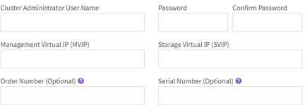

= Ausführung von Aufgaben nach der Installation
:allow-uri-read: 
:icons: font
:imagesdir: ../media/

[role="lead"]
Konfigurieren Sie nach der Installation von SolidFire ESDS den Clusternamen auf jedem SolidFire ESDS-Knoten. Anschließend können Sie einen SolidFire ESDS-Cluster erstellen.

Hier finden Sie einen Überblick über die Aufgaben, die Sie nach der Installation von SolidFire ESDS ausführen sollten:

*  the cluster name
*  the license key
*  a cluster
*  drives to the cluster

NOTE: Sie können den Link:https://github.com/NetApp-Automation/nar_solidfire_cluster_config verwenden[`nar_solidfire_cluster_config`^] Ansible-Rolle von NetApp zur Durchführung der Schritte nach der Installation Wenn Sie es manuell ausführen möchten, lesen Sie die unten beschriebenen Schritte.

== Konfigurieren Sie den Cluster-Namen

Sie sollten den Cluster-Namen auf jedem SolidFire ESDS-Knoten konfigurieren, bevor Sie den Node zu einem Cluster hinzufügen können. Dazu ist entweder die UI pro Node oder die Element API erforderlich.

IMPORTANT: Sie können den Cluster-Namen nicht ändern, nachdem das Cluster erstellt wurde.

.Schritte
. Wählen Sie eine der folgenden Optionen:
+
** Verwenden Sie die UI pro Node:
+
... Öffnen Sie die Management-Node-UI pro Node: `https://<node_mip>:442`.
... Wählen Sie *Cluster-Einstellungen* und geben Sie den Cluster-Namen ein.
... Wählen Sie *Änderungen Anwenden*.

** Verwenden Sie den Link:./API/reference_element_api_setclusterconfig.html[`SetClusterConfig`^] API-Methode.
+
Diese Methode verfügt über den folgenden Eingabeparameter:

+
[cols="5*"]
|===
| Name | Beschreibung | Typ | Standardwert | Erforderlich 

 a| 
`cluster`
 a| 
Konfigurationsattribute, die während dieses Methodenaufrufs geändert werden sollten. Nur die Felder, die geändert werden sollen, müssen dieser Methode als Mitglieder in diesem Parameter hinzugefügt werden.
 a| 
Cluster
 a| 
Keine
 a| 
Nein

|===
+
Das folgende Anforderungsbeispiel ist verfügbar:

+
[listing]
----
{
   "method": "SetClusterConfig",
   "params": {
      "cluster": {
         "name": "myhost",
         "mipi": "Bond10G"
      },
    "id" : 1
   }
}
----

== Legen Sie den Lizenzschlüssel fest

Wenn Sie einen SolidFire ESDS-Cluster erstellen, benötigen Sie die Lizenzschlüsselinformationen. Der NetApp Support benötigt außerdem die Lizenzschlüsselinformationen, die bei der Problembehebung helfen. Der Lizenzschlüssel für den SolidFire ESDS-Cluster besteht aus der Bestellnummer des Clusters kombiniert mit der Seriennummer und aktiviert das von Ihnen erworbene Kapazitätszeitlizenzmodell.

Sie können das verwenden `SetLicenseKey` Methode zum Festlegen des Lizenzschlüssels für den SolidFire ESDS-Speicher-Cluster. Der `SetLicenseKey` Die Methode verfügt über die folgenden Eingabeparameter:

[cols="5*"]
|===
| Name | Beschreibung | Typ | Standardwert | Erforderlich 

 a| 
`orderNumber`
 a| 
Die neue Bestellnummer für diesen Storage Cluster.
 a| 
Zeichenfolge
 a| 
Keine
 a| 
Ja.

 a| 
`serialNumber`
 a| 
Die neue Seriennummer für diesen Storage-Cluster.
 a| 
Zeichenfolge
 a| 
Keine
 a| 
Ja.

|===
Diese Methode verfügt über die folgenden Rückgabewerte:

[cols="3*"]
|===
| Name | Beschreibung | Typ 

 a| 
`orderNumber`
 a| 
Die neue Bestellnummer des Storage Clusters.
 a| 
Zeichenfolge

 a| 
`serialNumber`
 a| 
Die neue Seriennummer des Storage-Clusters.
 a| 
Zeichenfolge

|===
.Schritt
. Verwenden Sie die `SetLicenseKey` API-Methode, wie im folgenden Beispiel dargestellt:
+
Anforderungen für diese Methode sind ähnlich wie das folgende Beispiel:

+
[listing]
----
{
  "method": "SetLicenseKey",
  "params": {
    "orderNumber": "33601",
    "serialNumber": "30G56E3WV"   },
   "id" : 1
}
----
+
Diese Methode gibt eine Antwort zurück, die dem folgenden Beispiel ähnelt:

+
[listing]
----
{
   "id" : 1,
   "result" : {
      "serialNumber": "30G56E3WV",
      "orderNumber": "33601"
     }
   }
}
----

== Erstellen eines Clusters

Nachdem Sie den Cluster-Namen auf jedem SolidFire ESDS-Speicherknoten konfiguriert haben, können Sie entweder über die UI pro Node oder die Element-API ein Cluster erstellen.

IMPORTANT: Die Softwareverschlüsselung im Ruhezustand ist für SolidFire ESDS Cluster standardmäßig aktiviert. Wenn Sie die Standardeinstellung ändern möchten, sollten Sie dies tun, wenn Sie das Cluster mit der erstellen `CreateCluster` API-Methode.

.Schritte
. Wählen Sie eine der folgenden Optionen:
+
** Verwenden Sie die UI pro Node:
+
... Öffnen Sie die Management-Node-UI pro Node: `https://<node_mip>:442*`.
... Wählen Sie im linken Navigationsmenü die Option *Cluster erstellen* aus.
... Aktivieren Sie die Kontrollkästchen für die Nodes. Die SolidFire ESDS-Knoten werden als SFc100 angezeigt.
... Geben Sie folgende Informationen ein: Benutzername, Passwort, Management Virtual IP (MVIP)-Adresse, Speicher Virtual IP (SVIP)-Adresse, Software-Bestellnummer und Seriennummer.
+

NOTE: Sie können die MVIP- und SVIP-Adressen nach dem Erstellen des Clusters nicht ändern. Die Verwendung derselben IP-Adressen für MVIP und SVIP wird nicht unterstützt.

+

NOTE: Sie können den anfänglichen Cluster-Administrator-Benutzernamen nicht ändern.

+

IMPORTANT: Wenn Sie die Bestellnummer und Seriennummer nicht angeben, schlägt der Vorgang zum Erstellen des Clusters fehl.

+

... Bestätigen Sie, dass Sie die NetApp Endbenutzer-Lizenzvereinbarung gelesen haben.
... Wählen Sie *Cluster Erstellen*.
... Um zu überprüfen, ob ein Cluster erstellt wurde, melden Sie sich bei dem Cluster an: `http://mvip_ip`.
... Vergewissern Sie sich, dass ClusterName, SVIP, MVIP, Anzahl der Nodes und Elementversion korrekt sind.

** Verwenden Sie den Link:./API/reference_element_api_createcluster.html[`CreateCluster`^] API-Methode.
+
Diese Methode verfügt über die folgenden Eingabeparameter:

+
[cols="5*"]
|===
| Name | Beschreibung | Typ | Standardwert | Erforderlich 

 a| 
`acceptEula`
 a| 
Geben Sie an, dass Sie die Endnutzer-Lizenzvereinbarung akzeptieren, wenn Sie dieses Cluster erstellen. Um die EULA zu akzeptieren, setzen Sie diesen Parameter auf „true“.
 a| 
boolesch
 a| 
Keine
 a| 
Ja.

 a| 
`attributes`
 a| 
Liste von Name-Wert-Paaren im JSON-Objektformat.
 a| 
JSON-Objekt
 a| 
Keine
 a| 
Nein

 a| 
`enableSoftwareEncryptionAtRest`
 a| 
Aktivieren Sie diesen Parameter, um eine softwarebasierte Verschlüsselung im Ruhezustand zu verwenden. Standardmäßig auf SolidFire ESDS-Clustern auf „true“ gesetzt. Standardmäßig auf allen anderen Clustern auf false gesetzt.
 a| 
boolesch
 a| 
Richtig
 a| 
Nein

 a| 
`mvip`
 a| 
Fließende (virtuelle) IP-Adresse für den Cluster im Managementnetzwerk.
 a| 
Zeichenfolge
 a| 
Keine
 a| 
Ja.

 a| 
`nodes`
 a| 
CIP/SIP-Adressen der ersten Knotengruppe, die den Cluster einrichten. Die IP-Adresse dieses Node muss in der Liste enthalten sein.
 a| 
String-Array
 a| 
Keine
 a| 
Ja.

 a| 
`orderNumber`
 a| 
Alphanumerische Auftragsnummer. Erforderlich für SolidFire ESDS.
 a| 
Zeichenfolge
 a| 
Keine
 a| 
Nein (hardwarebasierte Plattformen) Ja (softwarebasierte Plattformen)

 a| 
`password`
 a| 
Anfängliches Passwort für das Cluster-Administratorkonto.
 a| 
Zeichenfolge
 a| 
Keine
 a| 
Ja.

 a| 
`serialNumber`
 a| 
Neunstellige alphanumerische Seriennummer. Erforderlich für SolidFire ESDS.
 a| 
Zeichenfolge
 a| 
Keine
 a| 
Nein (hardwarebasierte Plattformen) Ja (softwarebasierte Plattformen)

 a| 
`svip`
 a| 
Fließende (virtuelle) IP-Adresse für den Cluster im Storage-Netzwerk (iSCSI).
 a| 
Zeichenfolge
 a| 
Keine
 a| 
Ja.

 a| 
`username`
 a| 
Benutzername für den Cluster-Administrator.
 a| 
Zeichenfolge
 a| 
Keine
 a| 
Ja.

|===
+
Siehe folgende Beispielanforderung:

+
[listing]
----
{
  "method": "CreateCluster",
  "params": {
    "acceptEula": true,
    "mvip": "10.0.3.1",
    "svip": "10.0.4.1",
    "repCount": 2,
    "username": "Admin1",
    "password": "9R7ka4rEPa2uREtE",
    "attributes": {
      "clusteraccountnumber": "axdf323456"
    },
    "nodes": [
      "10.0.2.1",
      "10.0.2.2",
      "10.0.2.3",
      "10.0.2.4"
    ]
  },
  "id": 1
}
----

Weitere Informationen zu dieser Methode finden Sie unter Link:API/reference_element_api_createcluster.html[`CreateCluster`^].

== Fügen Sie dem Cluster Laufwerke hinzu

Sie sollten Laufwerke zu Ihrem SolidFire ESDS-Cluster hinzufügen, damit sie am Cluster teilnehmen können. Dazu wird entweder die Element UI oder die APIs verwendet.

.Schritte
. Wählen Sie eine der folgenden Optionen:
+
** Verwenden Sie die Element-UI:
+
... Wählen Sie in der Element UI die Option *Cluster* > *Laufwerke*.
... Wählen Sie *verfügbar*, um die Liste der verfügbaren Laufwerke anzuzeigen.
... Um einzelne Laufwerke hinzuzufügen, wählen Sie das Symbol *Aktionen* für das Laufwerk, das Sie hinzufügen möchten, und wählen Sie dann *Hinzufügen*.
... Um mehrere Laufwerke hinzuzufügen, aktivieren Sie die Kontrollkästchen für die Laufwerke, die hinzugefügt werden sollen, wählen Sie *Massenaktionen* und dann *Hinzufügen* aus.
... Vergewissern Sie sich, dass die Laufwerke hinzugefügt werden und die Cluster-Kapazität wie erwartet ist.

** Verwenden Sie die[`AddDrives`^] API-Methode.
+
Diese Methode verfügt über den folgenden Eingabeparameter:

+
[cols="5*"]
|===
| Name | Beschreibung | Typ | Standardwert | Erforderlich 

 a| 
`drives`
 a| 
Informationen über die einzelnen Laufwerke, die dem Cluster hinzugefügt werden sollen. Mögliche Werte:

*** DriveID: Die ID des Laufwerks, das hinzugefügt werden soll (Integer).
*** Typ: Der Typ des hinzufügenden Laufwerks (String). Gültige Werte sind „Slice“, „Block“ oder „Volume“. Wenn keine Angabe erfolgt, weist das System den korrekten Typ zu.

 a| 
JSON-Objekt-Array
 a| 
Keine
 a| 
Ja (Typ ist optional)

|===
+
Hier ein Beispiel für Anfragen:

+
[listing]
----
{
  "id": 1,
  "method": "AddDrives",
  "params": {
    "drives": [
      {
        "driveID": 1,
        "type": "slice"
      },
      {
        "driveID": 2,
        "type": "block"
      },
      {
        "driveID": 3,
        "type": "block"
      }
    ]
  }
}
----

Weitere Informationen zu dieser API-Methode finden Sie unter Link:./API/reference_element_api_adddrives.html[`AddDrives`^].

== Weitere Informationen

* https://www.netapp.com/data-storage/solidfire/documentation/["Ressourcen-Seite zu NetApp SolidFire"^]
* https://docs.netapp.com/sfe-122/topic/com.netapp.ndc.sfe-vers/GUID-B1944B0E-B335-4E0B-B9F1-E960BF32AE56.html["Dokumentation für frühere Versionen von NetApp SolidFire und Element Produkten"^]

