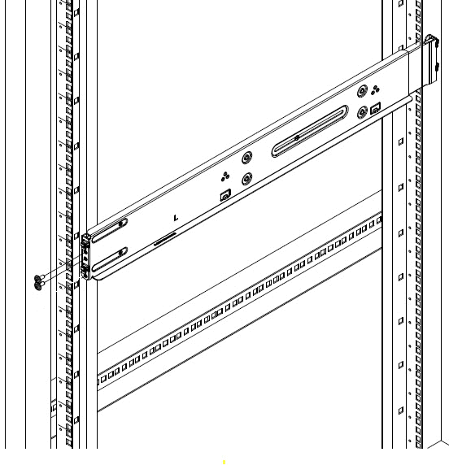
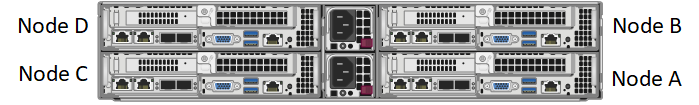
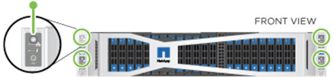
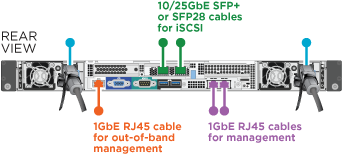

= Storage-Nodes der H-Series installieren
:allow-uri-read: 
:icons: font
:imagesdir: ../media/

[role="lead"]
Bevor Sie mit Ihrem All-Flash-Storage-System beginnen, sollten Sie die Storage Nodes richtig installieren und einrichten.

TIP: Siehe link:../media/hseries_isi.pdf["Poster"^] Für eine visuelle Darstellung der Anweisungen.

* <<Workflow-Diagramme>>
* <<Installation vorbereiten>>
* <<Installieren Sie die Schienen>>
* <<Installieren und verkabeln Sie die Nodes>>
* <<Konfigurieren Sie die Nodes>>
* <<Erstellen eines Clusters>>

== Workflow-Diagramme

Die Workflow-Diagramme hier bieten einen allgemeinen Überblick über die Installationsschritte. Die Schritte variieren je nach Modell der H-Serie leicht.

=== H410S

image::../media/h410s_isi_workflow.png[H410S Installations-Workflow]

=== H610S

NOTE: Die Begriffe „Node“ und „Chassis“ werden bei H610S synonym verwendet, da Node und Chassis keine separaten Komponenten sind wie bei einem 2-HE-Chassis mit vier Nodes.

image::../media/h610s_isi_workflow.png[H610S Installations-Workflow]

== Installation vorbereiten

Überprüfen Sie vor der Installation die gelieferten Hardware und wenden Sie sich an den NetApp Support, wenn Teile fehlen.

Stellen Sie sicher, dass Sie an Ihrem Installationsstandort die folgenden Elemente installiert haben:

* Rack-Platz für das System.

[cols="2*"]
|===
| Node-Typ | Rack-Fläche 

| H410S Nodes | Zwei Höheneinheiten (2 HE) 

| H610S Nodes | Eine Höheneinheit (1 HE) 
|===
* SFP28/SFP+ Direct-Attach-Kabel oder Transceiver
* CAT5e oder höhere Kabel mit RJ45-Stecker
* Ein Schalter für Tastatur, Video, Maus (KVM), um das System zu konfigurieren
* USB-Stick (optional)

TIP: Die Hardware, die an Sie geliefert wird, hängt davon ab, was Sie bestellen. Eine neue 2-HE-Bestellung mit vier Nodes umfasst das Chassis, die Blende, den Schienen-Kit, die Laufwerke, die Storage-Nodes, Und Stromkabel (zwei pro Chassis). Wenn Sie H610S Storage-Nodes bestellen, werden die Laufwerke im Chassis installiert.

CAUTION: Achten Sie beim Einbau der Hardware darauf, dass Sie das gesamte Verpackungsmaterial und die Verpackung aus dem Gerät entfernen. Dadurch wird verhindert, dass die Knoten überhitzt und heruntergefahren werden.

== Installieren Sie die Schienen

Die Hardwarebestellung, die Ihnen zugestellt wurde, enthält eine Reihe von Gleitschienen. Sie benötigen einen Schraubendreher, um die Schieneninstallation abzuschließen. Die Installationsschritte variieren für jedes Node-Modell entsprechend.

TIP: Installieren Sie die Hardware von der Unterseite des Racks bis zur Oberseite, um zu verhindern, dass das Gerät umkippeln kann. Wenn Ihr Rack Stabilisatoren beinhaltet, müssen Sie diese vor der Installation der Hardware installieren.

* <<H410S>>
* <<H610S>>

=== H410S

H410S Nodes sind in einem 2-HE-Chassis mit vier Nodes der H-Series installiert, das mit zwei Adaptersätzen ausgeliefert wird. Wenn Sie das Gehäuse in einem Rack mit runden Löchern einsetzen möchten, verwenden Sie die Adapter für ein Rack mit runden Löchern. Die Schienen für H410S Nodes passen ein Rack zwischen 29 Zoll und 33.5 Zoll Tiefe. Wenn die Schiene vollständig zusammengeschraubt ist, ist sie 28 Zoll lang, und die vorderen und hinteren Abschnitte der Schiene werden zusammen mit nur einer Schraube gehalten.

CAUTION: Wenn Sie das Gehäuse auf einer vollständig versetzten Schiene installieren, können die vorderen und hinteren Abschnitte der Schiene voneinander getrennt sein.

.Schritte
. Richten Sie die Vorderseite der Schiene an den Löchern an der vorderen Stange des Racks aus.
. Schieben Sie die Haken an der Vorderseite der Schiene in die Löcher an der vorderen Stange des Racks und dann nach unten, bis die federbelasteten Stangen in die Rack-Löcher einrasten.
. Befestigen Sie die Schiene mit Schrauben am Rack. Hier sehen Sie eine Abbildung der linken Schiene, die an der Vorderseite des Racks befestigt ist:
+

. Ziehen Sie den hinteren Teil der Schiene auf die hintere Stange des Racks.
. Richten Sie die Haken an der Rückseite der Schiene an den entsprechenden Löchern am hinteren Pfosten aus, um sicherzustellen, dass sich Vorder- und Rückseite der Schiene auf der gleichen Ebene befinden.
. Montieren Sie die Rückseite der Schiene am Rack und befestigen Sie die Schiene mit Schrauben.
. Führen Sie alle oben genannten Schritte für die andere Seite des Racks aus.

=== H610S

Folgende Abbildung zeigt die Installation von Schienen für einen H610S Storage-Node:

image::../media/h610s_rail_isi.gif[Rail-Installation für H610S Storage-Node]

TIP: Auf dem H610S befinden sich linke und rechte Schienen. Positionieren Sie die Schraubenbohrung nach unten, so dass die H610S-Daumenschraube das Gehäuse an der Schiene befestigen kann.

== Installieren und verkabeln Sie die Nodes

Der H410S Storage-Node wird in einem 2-HE-Chassis mit vier Nodes installiert. Installieren Sie bei H610S das Chassis/Node direkt auf den Schienen im Rack.

CAUTION: Entfernen Sie das gesamte Verpackungsmaterial und die Verpackung vom Gerät. So wird verhindert, dass die Nodes überhitzt und heruntergefahren werden.

* <<H410S>>
* <<H610S>>

=== H410S

.Schritte
. Installieren Sie die H410S Nodes im Chassis. Dies ist ein Beispiel aus der Rückansicht eines Chassis mit vier installierten Nodes:
+

+

WARNING: Gehen Sie beim Anheben der Hardware und beim Einbauen im Rack vorsichtig vor. Ein leeres 2-HE-Chassis mit vier Nodes wiegt 24.7 kg (54.45 lb) und ein Node wiegt 8.0 lb (3.6 kg).

. Installieren Sie die Laufwerke.
+
image::../media/hci_stor_node_ssd_bays.gif[Diese Abbildung zeigt die Vorderseite des 2-HE-s]

. Die Nodes verkabeln.
+

IMPORTANT: Wenn die Luftströmungsöffnungen an der Rückseite des Gehäuses durch Kabel oder Etiketten blockiert sind, kann dies zu vorzeitigen Komponentenausfällen aufgrund einer Überhitzung führen.

+
image::../media/hci_isi_storage_cabling.png[Diese Abbildung zeigt die Verkabelung eines H410S Storage-Node.]

+
** Verbinden Sie für die Managementkonnektivität zwei CAT5e- oder höhere Kabel mit den Ports A und B.
** Verbinden Sie zwei SFP28/SFP+-Kabel oder Transceiver in den Ports C und D für die Speicherkonnektivität.
** (Optional, empfohlen) Verbinden Sie ein CAT5e-Kabel mit dem IPMI-Port für Out-of-Band-Management-Konnektivität.

. Schließen Sie das Netzkabel an die beiden Netzteile pro Chassis an und stecken Sie sie in eine 240-V-PDU oder eine Steckdose.
. Schalten Sie die Nodes ein.
+

NOTE: Das Booten des Node dauert etwa sechs Minuten.

+

=== H610S

.Schritte
. Installieren Sie das H610S-Chassis. Hier sehen Sie eine Abbildung zur Installation des Node/Chassis im Rack:
+
image::../media/h610s_chassis_isi.gif[Zeigt den H610S Node/Chassis, der im Rack installiert ist.]

+

WARNING: Gehen Sie beim Anheben der Hardware und beim Einbauen im Rack vorsichtig vor. Ein H610S Chassis wiegt 18.4 kg (40.5 lb).

. Die Nodes verkabeln.
+

IMPORTANT: Wenn die Luftströmungsöffnungen an der Rückseite des Gehäuses durch Kabel oder Etiketten blockiert sind, kann dies zu vorzeitigen Komponentenausfällen aufgrund einer Überhitzung führen.

+

+
** Verbinden Sie den Node mit einem 10/25-GbE-Netzwerk mit zwei SFP28- oder SFP+-Kabeln.
** Verbinden Sie den Node über zwei RJ45-Anschlüsse mit einem 1-GbE-Netzwerk.
** Verbinden Sie den Node über einen RJ-45-Anschluss im IPMI-Port mit einem 1-GbE-Netzwerk.
** Verbinden Sie die beiden Stromkabel mit dem Node.

. Schalten Sie die Nodes ein.
+

NOTE: Es dauert etwa fünf Minuten und 30 Sekunden, bis der Node gebootet wird.

+
image::../media/h600s_isi_nodefront.png[Diese Abbildung zeigt die Vorderseite des H610S-Gehäuses mit einem Netzschalter.]

== Konfigurieren Sie die Nodes

Nachdem Sie die Hardware im Rack untergebracht und verkabeln, können Sie Ihre neue Speicherressource konfigurieren.

.Schritte
. Schließen Sie eine Tastatur und einen Monitor an den Knoten an.
. Konfigurieren Sie in der angezeigten Terminal User Interface (TUI) über die Bildschirmnavigation die Netzwerk- und Clustereinstellungen für den Knoten.
+

NOTE: Sie sollten die IP-Adresse des Knotens von der TUI erhalten. Dies ist erforderlich, wenn Sie einem Cluster den Node hinzufügen. Nachdem Sie die Einstellungen gespeichert haben, befindet sich der Node in einem ausstehenden Status und kann einem Cluster hinzugefügt werden. Weitere Informationen finden Sie im Abschnitt <INSERT Link to Setup >.

. Konfigurieren Sie die Out-of-Band-Verwaltung mit dem Baseboard Management Controller (BMC). Diese Schritte gelten *nur für H610S* Nodes.
+
.. Verwenden Sie einen Webbrowser, und navigieren Sie zur standardmäßigen BMC-IP-Adresse: 192.168.0.120
.. Melden Sie sich mit *root* als Benutzername und *calvin* als Passwort an.
.. Navigieren Sie im Bildschirm Knotenverwaltung zu *Einstellungen* > *Netzwerkeinstellungen* und konfigurieren Sie die Netzwerkparameter für den Out-of-Band-Management-Port.

TIP: Siehe https://kb.netapp.com/Advice_and_Troubleshooting/Hybrid_Cloud_Infrastructure/NetApp_HCI/How_to_access_BMC_and_change_IP_address_on_H610S["Dieser KB-Artikel (Anmeldung erforderlich)"].

== Erstellen eines Clusters

Nachdem Sie der Installation den Speicherknoten hinzugefügt und die neue Speicherressource konfiguriert haben, können Sie ein neues Storage-Cluster erstellen

.Schritte
. Greifen Sie von einem Client auf demselben Netzwerk wie der neu konfigurierte Node auf die NetApp Element Software-UI zu, indem Sie die IP-Adresse des Node eingeben.
. Geben Sie die erforderlichen Informationen im Fenster **Erstellen eines neuen Clusters** ein. Siehe link:../setup/concept_setup_overview.html["Setup-Übersicht"^] Finden Sie weitere Informationen.

== Weitere Informationen

* https://www.netapp.com/data-storage/solidfire/documentation/["Ressourcen-Seite zu NetApp SolidFire"^]
* https://docs.netapp.com/sfe-122/topic/com.netapp.ndc.sfe-vers/GUID-B1944B0E-B335-4E0B-B9F1-E960BF32AE56.html["Dokumentation für frühere Versionen von NetApp SolidFire und Element Produkten"^]

