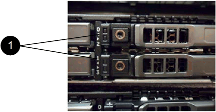

= Ersetzen von Laufwerken für SF-Series Storage-Nodes
:allow-uri-read: 
:icons: font
:imagesdir: ../media/

[role="lead"]
Sie können ein ausgefallenes Solid State-Laufwerk gegen ein Ersatzlaufwerk austauschen.

.Was Sie benötigen
* Sie haben ein Ersatzlaufwerk.
* Sie haben ein elektrostatisches Entladungsband (ESD) oder andere antistatische Vorsichtsmaßnahmen getroffen.
* Sie haben den NetApp Support kontaktiert, um zu überprüfen, ob die SSD ersetzt werden muss, und um die ordnungsgemäße Behebung des Problems zu gewährleisten.
+
Wenn Sie den NetApp Support anrufen, benötigen Sie die Service-Tag-Nummer oder die Seriennummer. Der Support wird mit Ihnen zusammenarbeiten, um eine Ersatzlaufwerk gemäß Ihrer Service-Level-Vereinbarung zu erhalten.

.Über diese Aufgabe
Die Anweisungen gelten für die folgenden SolidFire Storage-Node-Modelle:

* SF2405
* SF4805
* SF9605
* SF9608
* SF19210
* SF38410

[NOTE]
====
Je nach Version der Element Software werden die folgenden Nodes nicht unterstützt:

* Ab Element 12.7, SF2405 und SF9608 Storage Nodes
* Ab Element 12.0, SF3010, SF6010 und SF9010 Storage-Nodes

====
Die folgende Abbildung zeigt die Platzierung der Laufwerke in einem SF9605 Chassis:

image::../media/sf_drives.gif[Diese Abbildung zeigt die Laufwerke im SolidFire-Chassis.]

NOTE: Die obige Abbildung ist ein Beispiel. SF9608 verfügt über ein anderes Laufwerkslayout, das nur acht Laufwerke enthält, die von links nach rechts mit einer Durchfahrt von acht nummeriert sind.

In Steckplatz 0 ist das Metadatenlaufwerk für den Node gespeichert. Wenn Sie das Laufwerk in Steckplatz 0 ersetzen, müssen Sie den Aufkleber im Lieferumfang des Ersatzlaufwerks anbringen, damit Sie es separat vom Rest identifizieren können.

[NOTE]
====
Beachten Sie bei der Handhabung von Laufwerken die folgenden Best Practices:

* Vermeiden Sie elektrostatische Entladungen, indem Sie das Laufwerk in der ESD-Tasche halten, bis Sie bereit sind, es zu installieren.
* Setzen Sie kein Metallwerkzeug oder Messer in den ESD-Beutel.
* Öffnen Sie die ESD-Tasche von Hand oder schneiden Sie die Oberseite mit einer Schere ab.
* Bewahren Sie den ESD-Beutel und alle Verpackungsmaterialien auf, falls Sie später ein Laufwerk zurückschicken müssen.
* Tragen Sie stets ein ESD-Handgelenkband, das an einer unbemalten Oberfläche auf Ihrem Chassis geerdet ist.
* Beim Entfernen, Installieren oder Tragen eines Laufwerks immer beide Hände verwenden.
* Niemals ein Laufwerk in das Chassis zwingen.
* Legen Sie keine Laufwerke aufeinander ab.
* Verwenden Sie beim Transport von Laufwerken stets die genehmigte Verpackung.

====
Hier finden Sie eine grobe Übersicht über die Schritte:

* <<Entfernen Sie das Laufwerk aus dem Cluster>>
* <<Setzen Sie das Laufwerk aus dem Gehäuse wieder ein>>
* <<Fügen Sie das Laufwerk dem Cluster hinzu>>

== Entfernen Sie das Laufwerk aus dem Cluster

Das SolidFire-System setzt ein Laufwerk in den Status „ausgefallen“, wenn die Selbstdiagnose des Laufwerks den Node angibt, an dem es ausgefallen ist, oder ob die Kommunikation mit dem Laufwerk fünf oder anderthalb Minuten lang unterbrochen wird. Das System zeigt eine Liste der ausgefallenen Laufwerke an. Entfernen Sie ein ausgefallenes Laufwerk aus der Liste ausgefallener Laufwerke in der NetApp Element Software.

.Schritte
. Wählen Sie in der Element UI die Option *Cluster* > *Laufwerke*.
. Wählen Sie *fehlgeschlagen* aus, um die Liste der ausgefallenen Laufwerke anzuzeigen.
. Notieren Sie sich die Steckplatznummer des ausgefallenen Laufwerks.
+
Sie benötigen diese Informationen, um das ausgefallene Laufwerk im Chassis zu finden.

. Entfernen Sie das ausgefallene Laufwerk mit einer der folgenden Methoden:
+
[cols="2*"]
|===
| Option | Schritte 

 a| 
Um einzelne Laufwerke zu entfernen
 a| 
.. Wählen Sie *Aktionen* für das Laufwerk, das Sie entfernen möchten.
.. Wählen Sie *Entfernen*.

 a| 
Um mehrere Laufwerke zu entfernen
 a| 
.. Wählen Sie alle Laufwerke aus, die Sie entfernen möchten, und wählen Sie *Massenaktionen*.
.. Wählen Sie *Entfernen*.

|===

== Setzen Sie das Laufwerk aus dem Gehäuse wieder ein

Nachdem Sie ein ausgefallenes Laufwerk in der Element UI aus der Liste ausgefallener Laufwerke entfernt haben, sind Sie bereit, das ausgefallene Laufwerk physisch aus dem Chassis zu ersetzen.

.Schritte
. Packen Sie das Ersatzlaufwerk aus und legen Sie es auf eine flache, statische Oberfläche in der Nähe des Racks.
+
Speichern Sie das Verpackungsmaterial für, wenn Sie das ausgefallene Laufwerk an NetApp zurücksenden.

. Ordnen Sie die Steckplatznummer des ausgefallenen Laufwerks von der Element-UI mit der Nummer auf dem Chassis an.
+
Die folgende Abbildung zeigt die Nummerierung der Laufwerksschächte an:

+

+
[cols="2*"]
|===
| Element | Beschreibung 

 a| 
1
 a| 
Laufwerkssteckplatznummern

|===
. Drücken Sie den roten Kreis auf dem Laufwerk, das Sie entfernen möchten, um das Laufwerk zu lösen.
+
Die Verriegelung öffnet sich.

. Schieben Sie das Laufwerk aus dem Gehäuse heraus und legen Sie es auf einer statischen, Ebenen Fläche ab.
. Drücken Sie den roten Kreis auf dem Ersatzlaufwerk, bevor Sie ihn in den Steckplatz schieben.
. Setzen Sie das Ersatzlaufwerk ein, und drücken Sie den roten Kreis, um die Verriegelung zu schließen.
. Benachrichtigen Sie den NetApp Support über den Austausch von Laufwerken.
+
Der NetApp Support enthält Anweisungen zum Zurücksenden des ausgefallenen Laufwerks.

== Fügen Sie das Laufwerk dem Cluster hinzu

Nachdem Sie ein neues Laufwerk im Gehäuse installiert haben, wird es als verfügbar registriert. Sie sollten das Laufwerk über die Element-UI zum Cluster hinzufügen, bevor es am Cluster teilnehmen kann.

.Schritte
. Klicken Sie in der Element-UI auf *Cluster* > *Laufwerke*.
. Klicken Sie auf *verfügbar*, um die Liste der verfügbaren Laufwerke anzuzeigen.
. Wählen Sie eine der folgenden Optionen zum Hinzufügen von Laufwerken:
+
[cols="2*"]
|===
| Option | Schritte 

 a| 
Um einzelne Laufwerke hinzuzufügen
 a| 
.. Wählen Sie die Schaltfläche *Aktionen* für das Laufwerk, das Sie hinzufügen möchten.
.. Wählen Sie *Hinzufügen*.

 a| 
Um mehrere Laufwerke hinzuzufügen
 a| 
.. Aktivieren Sie die Kontrollkästchen der Laufwerke, die hinzugefügt werden sollen, und wählen Sie dann *Massenaktionen* aus.
.. Wählen Sie *Hinzufügen*.

|===

== Weitere Informationen

* https://docs.netapp.com/us-en/element-software/index.html["Dokumentation von SolidFire und Element Software"]
* https://docs.netapp.com/sfe-122/topic/com.netapp.ndc.sfe-vers/GUID-B1944B0E-B335-4E0B-B9F1-E960BF32AE56.html["Dokumentation für frühere Versionen von NetApp SolidFire und Element Produkten"^]

