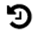

= Symbole in der Element-Schnittstelle
:allow-uri-read: 
:icons: font
:imagesdir: ../media/

[role="lead"]
Die NetApp Element-Softwareoberfläche zeigt Symbole an, die Aktionen darstellen, die Sie für Systemressourcen ergreifen können.

Folgende Tabelle enthält eine Kurzübersicht:

|===

| Symbol | Beschreibung 

 a| 
image:../media/element_icon_action.gif["Aktionen-Symbol in Element OS Web-UI"]
 a| 
Aktionen

 a| 
image:../media/element_icon_backupto.gif["Backupto-Symbol in der Element OS Web-UI"]
 a| 
Backup auf

 a| 
image:../media/element_icon_clone.gif["Clone-Symbol in Element OS Web-UI"]
 a| 
Klon oder Kopie

 a| 

 a| 
Löschen oder löschen

 a| 
image:../media/element_icon_edit.gif["Symbol bearbeiten in Element OS Web UI"]
 a| 
Bearbeiten

 a| 
image:../media/element_icon_filter.gif["Filtersymbol in Element OS Web-UI"]
 a| 
Filtern

 a| 
image:../media/element_icon_pair.gif["Pairsymbol in Element OS Web-UI"]
 a| 
Paar

 a| 
image:../media/element_icon_refresh.gif["Symbol „Aktualisieren“ in der Element OS Web-UI"]
 a| 
Aktualisierung

 a| 
image:../media/element_icon_restore.gif["Symbol in Element OS Web UI wiederherstellen"]
 a| 
Wiederherstellen

 a| 
image:../media/element_icon_restorefrom.gif["Wiederherstellung vom Symbol in Element OS Web UI"]
 a| 
Wiederherstellen von

 a| 

 a| 
Rollback

 a| 
image:../media/element_icon_snapshot.gif["Snapshot-Symbol in der Element OS Web-UI"]
 a| 
Snapshot

|===