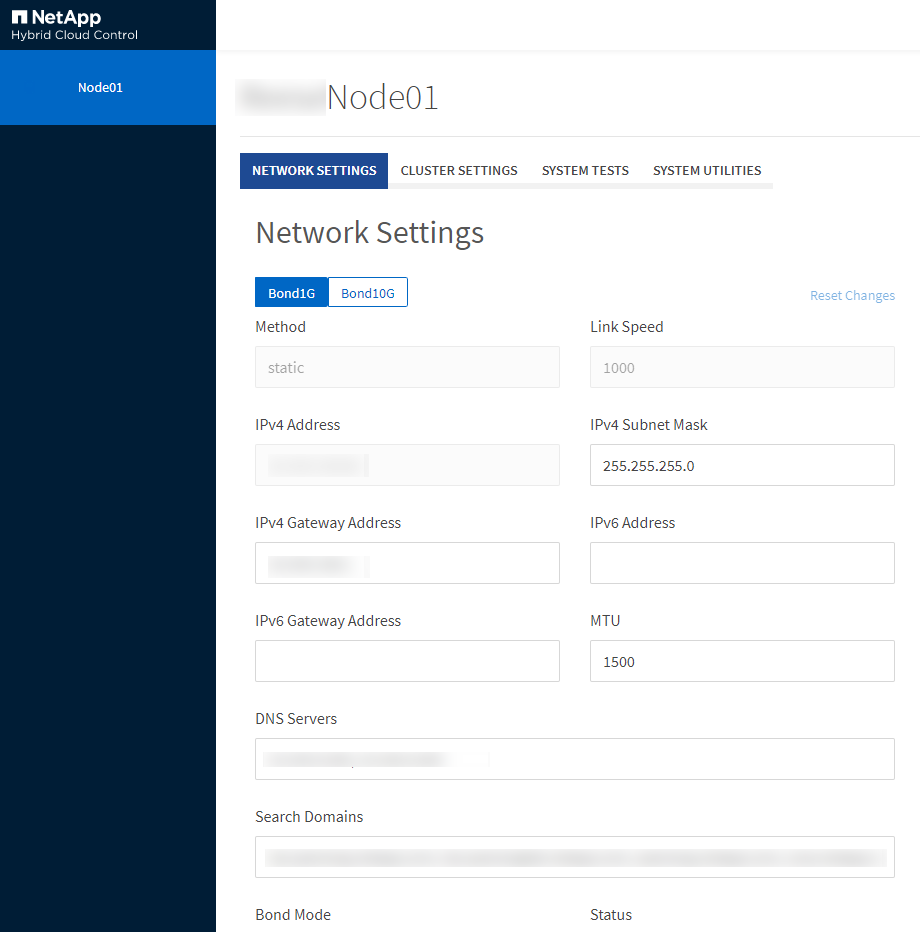

= Über die UI pro Node können Sie auf Einstellungen pro Node zugreifen
:allow-uri-read: 
:icons: font
:imagesdir: ../media/

[role="lead"]
Nach Eingabe der Management-Node-IP und Authentifizierung haben Sie in der Benutzeroberfläche per Node Zugriff auf Netzwerkeinstellungen, Cluster-Einstellungen sowie Systemtests und Dienstprogramme.

Wenn Sie die Einstellungen für einen Node in einem aktiven Status ändern möchten, der Teil eines Clusters ist, müssen Sie sich als Cluster-Administrator-Benutzer einloggen.

TIP: Sie sollten Nodes jeweils einzeln konfigurieren oder ändern. Sie sollten sicherstellen, dass die angegebenen Netzwerkeinstellungen den erwarteten Effekt haben und dass das Netzwerk stabil und gut funktioniert, bevor Sie Änderungen an einem anderen Node vornehmen.

. Öffnen Sie die UI pro Node mit einer der folgenden Methoden:
+
** Geben Sie die Management-IP-Adresse gefolgt von :442 in einem Browser-Fenster ein, und melden Sie sich mit einem Admin-Benutzernamen und -Passwort an.
** Wählen Sie in der Element UI *Cluster* > *Nodes* aus und klicken Sie auf den Link Management-IP-Adresse für den Knoten, den Sie konfigurieren oder ändern möchten. Im geöffneten Browser-Fenster können Sie die Einstellungen des Node bearbeiten.

+

