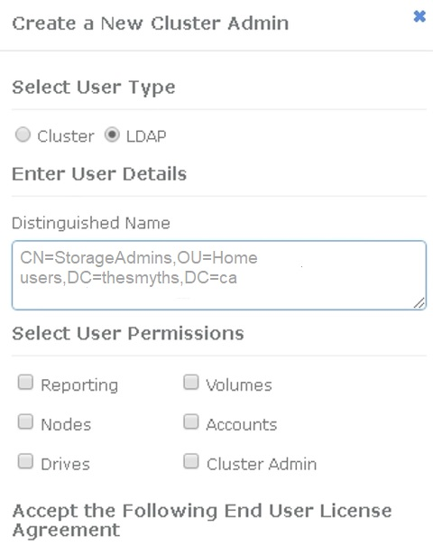

= Aktivieren Sie die LDAP-Authentifizierung über die Benutzeroberfläche von Element
:allow-uri-read: 
:icons: font
:imagesdir: ../media/

[role="lead"]
Sie können die Integration des Speichersystems mit einem vorhandenen LDAP-Server konfigurieren. Dies ermöglicht LDAP-Administratoren ein zentrales Management des Speichersystemzugriffs für Benutzer.

Sie können LDAP entweder mit der Element-Benutzeroberfläche oder der Element-API konfigurieren. In diesem Verfahren wird beschrieben, wie LDAP über die Element-UI konfiguriert wird.

Dieses Beispiel zeigt, wie die LDAP-Authentifizierung auf SolidFire konfiguriert und verwendet wird `SearchAndBind` Als Authentifizierungstyp. Das Beispiel verwendet einen einzelnen Windows Server 2012 R2 Active Directory Server.

. Klicken Sie auf *Cluster* > *LDAP*.
. Klicken Sie auf *Ja*, um die LDAP-Authentifizierung zu aktivieren.
. Klicken Sie auf *Server hinzufügen*.
. Geben Sie die * Hostname/IP-Adresse* ein.
+

NOTE: Es kann auch eine optionale benutzerdefinierte Portnummer eingegeben werden.

+
Wenn Sie beispielsweise eine benutzerdefinierte Portnummer hinzufügen möchten, geben Sie <Host Name oder ip-Adresse>:<Port number> ein

. Wählen Sie *LDAPS-Protokoll verwenden*.
. Geben Sie die erforderlichen Informationen unter *Allgemeine Einstellungen* ein.
+
link:concept_system_manage_manage_ldap.html#view_ldap_details["LDAP-Details"]

+
image::../media/element_new_ldap_servers.jpg[Element neuer ldap-Server]

. Klicken Sie auf *LDAP aktivieren*.
. Klicken Sie auf *Benutzerauthentifizierung testen*, wenn Sie den Serverzugriff für einen Benutzer testen möchten.
. Kopieren Sie den Distinguished Name und Benutzergruppeninformationen, die später beim Erstellen von Cluster-Administratoren angezeigt werden.
. Klicken Sie auf *Änderungen speichern*, um neue Einstellungen zu speichern.
. Um einen Benutzer in dieser Gruppe zu erstellen, damit sich jeder anmelden kann, führen Sie Folgendes aus:
+
.. Klicken Sie Auf *Benutzer* > *Ansicht*.
+

.. Klicken Sie für den neuen Benutzer auf *LDAP* für den Benutzertyp, und fügen Sie die Gruppe ein, die Sie in das Feld Distinguished Name kopiert haben.
.. Wählen Sie die Berechtigungen aus, normalerweise alle Berechtigungen.
.. Scrollen Sie nach unten zur Endbenutzer-Lizenzvereinbarung und klicken Sie auf *Ich akzeptiere*.
.. Klicken Sie Auf *Cluster-Admin Erstellen*.
+
Jetzt haben Sie einen Benutzer mit dem Wert einer Active Directory-Gruppe.

Um dies zu testen, melden Sie sich von der Element UI ab und melden Sie sich als Benutzer in dieser Gruppe an.

== Verwandte Informationen

* link:concept_system_manage_manage_cluster_administrator_users.html#create_cluster_admin_account["Erstellen eines Cluster-Administratorkontos"]
* link:concept_system_manage_manage_ldap.html#view_ldap_details["LDAP-Details"]

